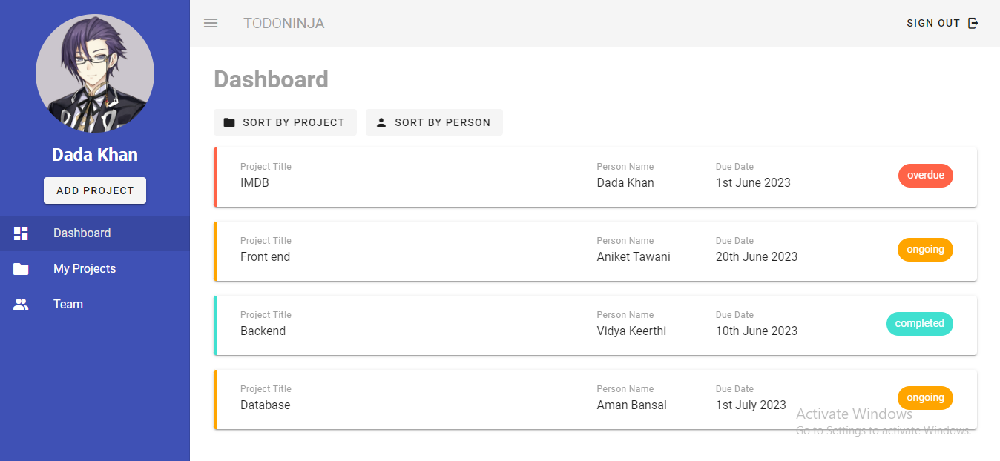
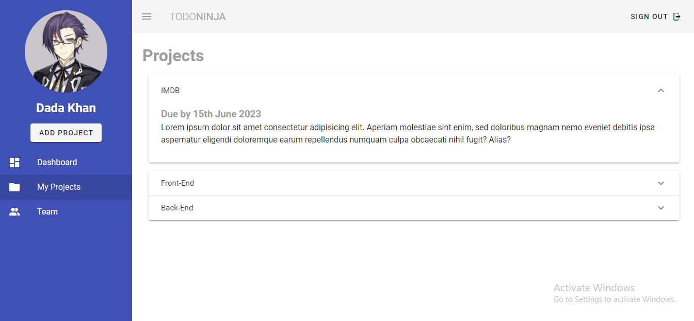
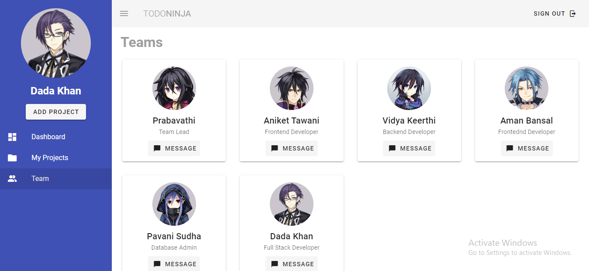
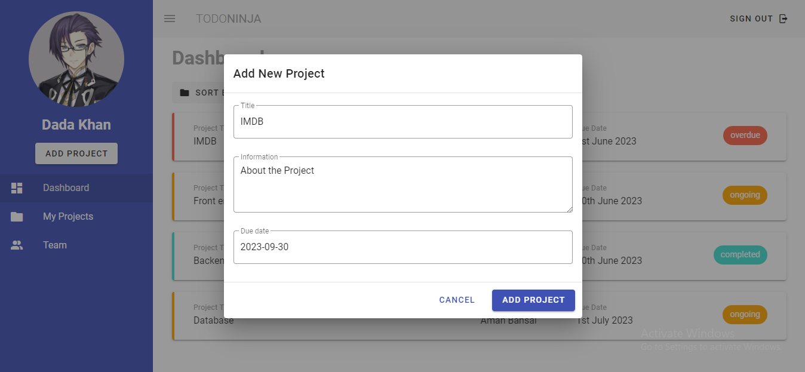
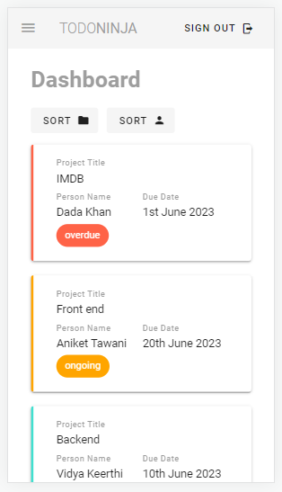
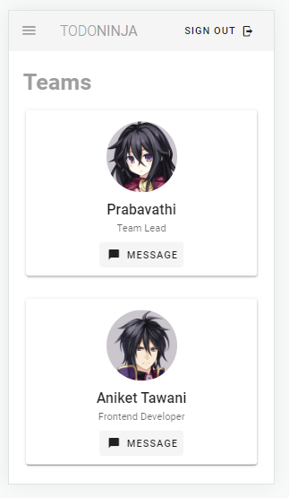
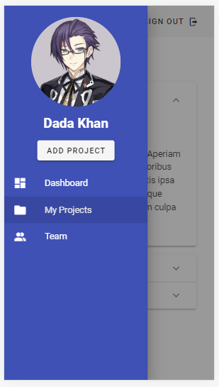

# Todo-Ninja
The <a href="https://todo-ninja-vuetify.netlify.app/">TODO NINJA</a> project is a simple web application that allows users to create, edit, and delete tasks. The project is built using Vue and Vuetify, which are a powerful combination for creating beautiful and user-friendly web applications.

Here are some of the benefits of using Vue and Vuetify for a TODO NINJA project:

<ul>
  <li>Vue is a lightweight and easy-to-learn framework. This makes it a great choice for beginners who want to create a TODO project.</li>
  <li>Vuetify provides a rich set of components that can be used to create a beautiful and user-friendly todo list. This can save you a lot of time and effort, as you won't need to build your own components from scratch.</li>
</ul>

# Screenshots

# Mobile View

  
  
    

